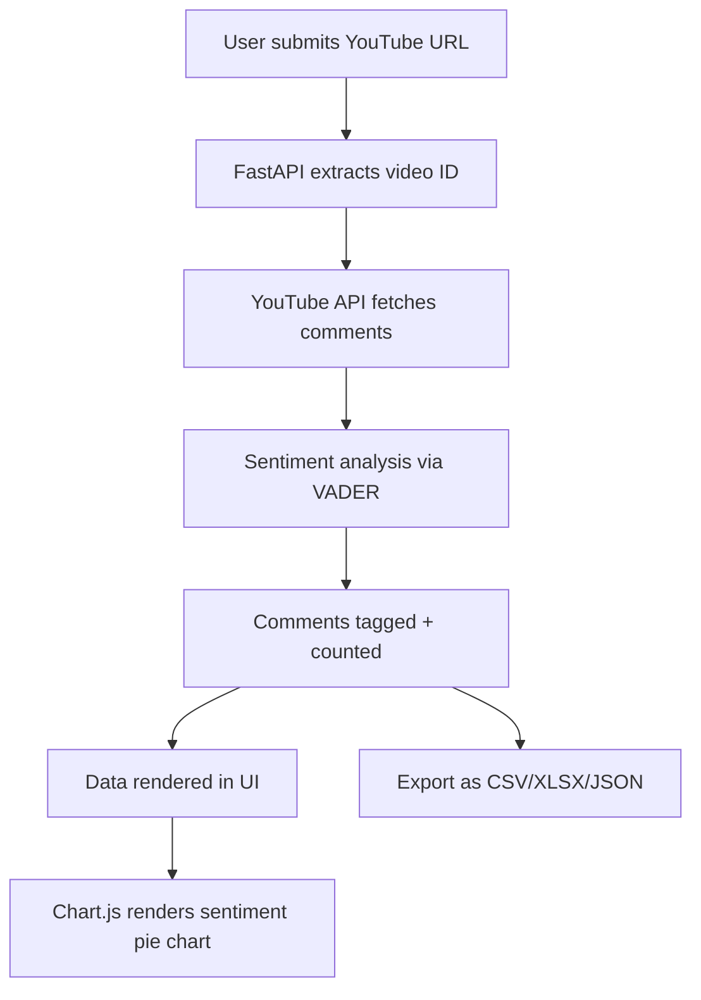

# 📘 YouTube Comment Analyzer

## 🧠 Introduction

**YouTube Comment Analyzer** is a web-based tool that allows users to extract and analyze comments from any public YouTube video. With just a video URL, the tool fetches comments via the YouTube Data API, performs sentiment analysis, and presents the results with visual insights and download options.

### 🔍 What is it?
A lightweight web application that:
- Fetches comments from any YouTube video
- Performs sentiment analysis (positive/negative/neutral)
- Allows users to download results in CSV, Excel (XLSX), or JSON
- Displays visual summaries (e.g., sentiment pie chart)

### 💡 Why build it?
YouTube is a massive source of user feedback, public opinion, and engagement insights. This tool helps:
- Researchers understand audience sentiment
- Content creators gather viewer feedback at scale
- Analysts extract structured insights from unstructured comments

---

## ⚙️ How it Works

### 🔧 Tech Stack
| Layer          | Tech Used                     |
|----------------|-------------------------------|
| **Frontend**   | HTML + Bootstrap + Chart.js    |
| **Backend**    | FastAPI (Python)               |
| **Data Source**| YouTube Data API v3            |
| **Analysis**   | NLTK (VADER sentiment)         |
| **Export**     | Pandas (CSV/XLSX/JSON)         |
| **Storage**    | In-memory + on-demand file save|

---

## 📈 Features

- ✅ Extracts all top-level YouTube comments
- ✅ Allows `max_results` to limit comment fetch size
- ✅ Adds sentiment classification to each comment
- ✅ Calculates sentiment distribution percentages
- ✅ Exports labeled comments as CSV, Excel, or JSON
- ✅ Displays a pie chart of sentiment distribution
- ✅ Fully interactive UI with no login required

---

## 🛠️ Project Setup & Steps

### Step 1: Basic Setup
- Initialized FastAPI project
- Connected to YouTube Data API
- Built `/comments` route to fetch comments

### Step 2: Pagination & Parameters
- Added support for multiple pages of results
- Introduced `max_results` to control API fetch size

### Step 3: Sentiment Analysis
- Used NLTK's VADER to classify sentiment
- Tagged each comment as Positive, Negative, or Neutral

### Step 4: Exporting
- Created export routes for `.csv`, `.xlsx`, and `.json`
- Used `pandas` to generate downloadable files

### Step 5: UI Integration
- Created a Bootstrap web form
- Rendered sentiment pie chart using Chart.js
- Displayed download links for each format

---

## 🔁 Workflow Diagram

---

## 📸 Screenshots

> _Note: Add your screenshots in a `screenshots/` folder and link them below._

**1. Home Page**

**2. Sentiment Chart Output**

**3. Exported CSV Sample**

---

## 📦 Next Steps

- Add comment filters (e.g., likes > X, contains keyword)
- Add preview of top comments by sentiment
- Implement background job support (for large videos)
- Bundle into a Chrome Extension

---

## 📬 Contact

Built with ❤️ using FastAPI and Open Source tools.
